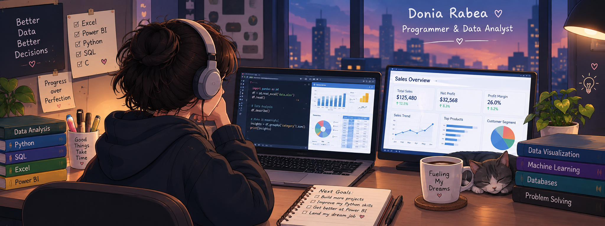

<div align="center">



<br>

# Donia Rabea 👋

### 💻 Programmer | 📊 Data Analyst | 📣 PR Member

**Computer Science Student** passionate about **Data Analysis, Programming, and Data Visualization**.

I enjoy working with data, creating dashboards, finding insights, and solving problems using technology.

<br>


<a href="https://www.linkedin.com/in/donia-rabea-04668837a/">
  
</a>

<a href="mailto:doniara555@gmail.com">
  
</a>


</div>

<hr>

## 🚀 Tools & Technologies

### 📊 Data Analysis & Visualization


### 💻 Programming & Databases


### 🛠️ Other Tools


<hr>

## 👩‍💻 About Me

* 🎓 Computer Science Student
* 📊 Data Analyst interested in turning data into meaningful insights
* 📈 Experienced in creating **Excel dashboards and data analysis projects**
* 📊 Working with **Power BI** for data visualization and interactive dashboards
* 🐍 Developing my skills in **Python** for data analysis and programming
* 🗄️ Learning and practicing **SQL** and database concepts
* 💻 Building my programming and problem-solving skills with **C**
* 🚀 Always learning and working on new projects
* 📣 PR Member with an interest in communication and teamwork

<hr>
🤝 Soft Skills

- Communication
- Teamwork
- Problem Solving
- Presentation
- Leadership
- Public Relations


<hr>

## 🌐 Connect with Me

<a href="https://www.linkedin.com/in/donia-rabea-04668837a/">
  
</a>

<hr>
📚 My Data Analysis Skills

| Skill           | Focus                                               |
| --------------- | --------------------------------------------------- |
| 📗 **Excel**    | Data Cleaning • Analysis • PivotTables • Dashboards |
| 📊 **Power BI** | Data Visualization • Dashboards • Reports           |
| 🐍 **Python**   | Programming • Data Analysis                         |
| 🗄️ **SQL**     | Queries • Databases • Data Retrieval                |

<hr>

## 💡 What I Like Working On

```text
📊 Data Analysis
📈 Interactive Dashboards
🧹 Data Cleaning
🔍 Finding Insights
🐍 Python Programming
🗄️ SQL & Databases
💻 Problem Solving
```

<hr>

## 🎯 Currently Learning

* 📊 Improving my **Excel & Power BI** skills
* 🐍 Developing my **Python** skills
* 🗄️ Practicing **SQL**
* 💻 Improving my programming and problem-solving skills
* 🚀 Building projects to strengthen my portfolio

<hr>

## 📊 GitHub Stats

<div align="center">


</div>

<hr>

## 🌱 My Goal

> To grow as a programmer and data analyst, build real-world projects, and use data to solve problems and create meaningful insights.

<br>

<div align="center">

### 💙 Thanks for visiting my profile!

**Keep Learning • Keep Building • Keep Growing 🚀**

</div>
